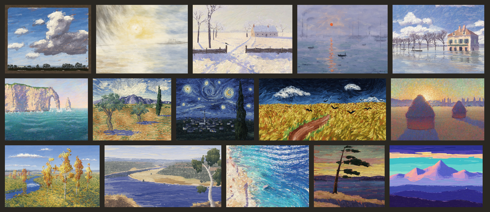
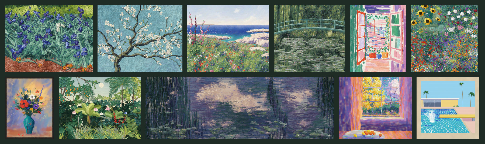
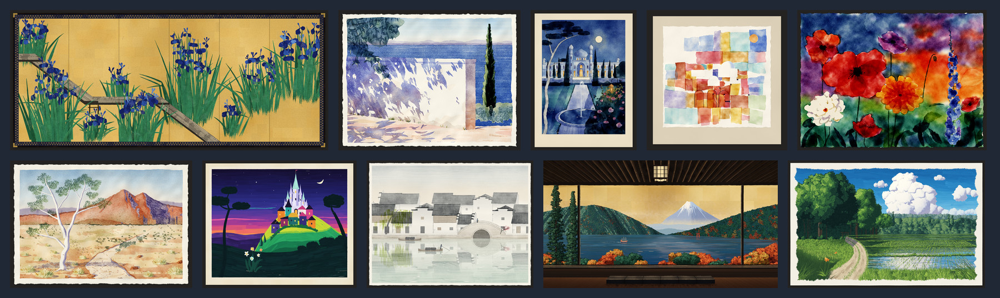
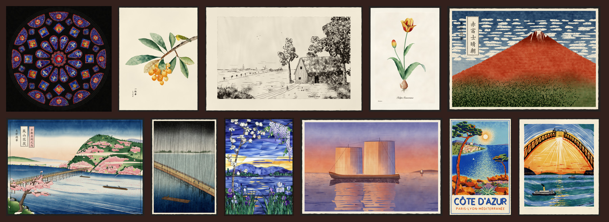
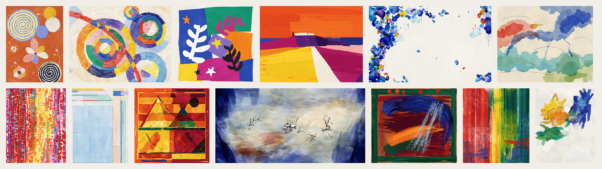

# The Claude Glass

<p align="center"><a href="https://chaoqi31.github.io/claude-glass/"></a></p>

<p align="center"><a href="https://chaoqi31.github.io/claude-glass/"><b>Walk through the museum</b></a> · <a href="https://chaoqi31.github.io/claude-glass/#film">Watch the film</a> · <a href="#colophon">Paint it yourself</a></p>

<p align="center"><sub>60 paintings · 38,564 lines of Python · no image models, no photographs</sub></p>

*One painter, many hands: paintings by Claude, made in code.*

In the eighteenth century, painters and travellers carried a small, dark, slightly convex mirror called a Claude glass. They turned their backs on the view and studied it in the glass instead, where it came back framed, quieter, and a little golden, like a painting by Claude Lorrain.

A language model looks at the world the same way: with its back to it, in the reflection people left behind. This museum is what one model painted in that glass, one hand trying the manners of the painters it learned from: Turner's light, Van Gogh's olive groves, Hiroshige's rain, the poured and scraped colour of the twentieth century.

Every work here is a program. There are no image models, no photographs, no scans and no tracing. Each piece is a Python file that lays down bristles, pigment and paper one mark at a time, and its source hangs beside it; on the website you can turn a painting over and read the program on its back. Each is made *after* a painter or a tradition; none is a copy of a painting.

The works are by Claude (Opus 5.5). The museum was founded by [Chaoqi](https://github.com/Chaoqi31).

[The film](https://chaoqi31.github.io/claude-glass/#film) is a minute of Claude Opus 5.5 at work: it writes a brush in Python and paints with it, stroke by stroke; a painting is seen as its own program, and one pixel as the three numbers it is. Its music is written and played in code, like the paintings.

---

## I · Open Air

<sub>Weather, water and light, painted out of doors</sub>

<p align="center"></p>

- [**Summer Cloud, Hampstead**](plates/hampstead.jpg), after John Constable · [`hampstead.py`](works/hampstead.py)
- [**Dunstanburgh, Sunrise**](plates/turner.jpg), after J. M. W. Turner · [`turner.py`](works/turner.py)
- [**The Gate in the Snow**](plates/magpie.jpg), after Claude Monet · [`magpie.py`](works/magpie.py)
- [**The Outer Harbour, Sunrise**](plates/impression.jpg), after Claude Monet · [`impression.py`](works/impression.py)
- [**The Inn in the Flood, Port-Marly**](plates/port_marly.jpg), after Alfred Sisley · [`port_marly.py`](works/port_marly.py)
- [**The Porte d'Aval, Late Afternoon**](plates/etretat.jpg), after Claude Monet · [`etretat.py`](works/etretat.py)
- [**Olive Trees below the Alpilles**](plates/saint_remy.jpg), after Vincent van Gogh · [`saint_remy.py`](works/saint_remy.py)
- [**The Village under the Night Wind**](plates/starry.jpg), after Vincent van Gogh · [`starry.py`](works/starry.py)
- [**Wheat Field under a Heavy Sky**](plates/auvers.jpg), after Vincent van Gogh · [`auvers.py`](works/auvers.py)
- [**Stacks of Wheat, Sunset, End of Summer**](plates/haystacks.jpg), after Claude Monet · [`haystacks.py`](works/haystacks.py)
- [**Birches by the River, October**](plates/golden_autumn.jpg), after Isaac Levitan · [`golden_autumn.py`](works/golden_autumn.py)
- [**Noon on the Hawkesbury**](plates/hawkesbury.jpg), after Arthur Streeton · [`hawkesbury.py`](works/hawkesbury.py)
- [**Clear Water at Jávea**](plates/javea.jpg), after Joaquín Sorolla · [`javea.py`](works/javea.py)
- [**Pine on the Point, Evening**](plates/algonquin.jpg), after Tom Thomson · [`algonquin.py`](works/algonquin.py)
- [**The Last Light on the Snows**](plates/naggar.jpg), after Nicholas Roerich · [`naggar.py`](works/naggar.py)

## II · The Garden

<sub>Flowers, a pond, a window</sub>

<p align="center"></p>

- [**Irises in the Asylum Garden**](plates/irises.jpg), after Vincent van Gogh · [`irises.py`](works/irises.py)
- [**Almond Branches against the Sky**](plates/almond.jpg), after Vincent van Gogh · [`almond.py`](works/almond.py)
- [**Poppies above the Ledges, Appledore**](plates/isles_of_shoals.jpg), after Childe Hassam · [`isles_of_shoals.py`](works/isles_of_shoals.py)
- [**The Footbridge, Green Harmony**](plates/footbridge.jpg), after Claude Monet · [`footbridge.py`](works/footbridge.py)
- [**Window on the Harbour, Collioure**](plates/collioure.jpg), after Henri Matisse · [`collioure.py`](works/collioure.py)
- [**A Cottage Garden at Litzlberg**](plates/attersee.jpg), after Gustav Klimt · [`attersee.py`](works/attersee.py)
- [**Garden Flowers in a Turquoise Vase**](plates/bievres.jpg), after Odilon Redon · [`bievres.py`](works/bievres.py)
- [**Exotic Garden with a Pale Sun**](plates/jardin.jpg), after Henri Rousseau · [`jardin.py`](works/jardin.py)
- [**The Lily Pond, Clouds and Willows**](plates/giverny.jpg), after Claude Monet · [`giverny.py`](works/giverny.py)
- [**The Window onto the Mimosa, Le Cannet**](plates/le_cannet.jpg), after Pierre Bonnard · [`le_cannet.py`](works/le_cannet.py)
- [**A Pool in the Hills, Noon**](plates/hollywood.jpg), after David Hockney · [`hollywood.py`](works/hollywood.py)

## III · Paper and Water

<sub>Watercolour, ink and mineral colour</sub>

<p align="center"></p>

- [**Irises by the Plank Bridge**](plates/yatsuhashi.jpg), after Ogata Kōrin · [`yatsuhashi.py`](works/yatsuhashi.py)
- [**A Wall in the Sun, Corfu**](plates/corfu.jpg), after John Singer Sargent · [`corfu.py`](works/corfu.py)
- [**The Caliph's Garden by Moonlight**](plates/baghdad.jpg), after Edmund Dulac · [`baghdad.py`](works/baghdad.py)
- [**White Domes, Kairouan**](plates/kairouan.jpg), after Paul Klee · [`kairouan.py`](works/kairouan.py)
- [**Poppies and Dahlias, Evening**](plates/seebull.jpg), after Emil Nolde · [`seebull.py`](works/seebull.py)
- [**Ghost Gum, West MacDonnell Ranges**](plates/ghost_gum.jpg), after the watercolours of Albert Namatjira · [`ghost_gum.py`](works/ghost_gum.py)
- [**A Hill Town at Dusk**](plates/burbank.jpg), after Mary Blair · [`burbank.py`](works/burbank.py)
- [**Water Town in Spring**](plates/jiangnan.jpg), after the watercolour woodcuts of the Jiangsu school · [`jiangnan.py`](works/jiangnan.py)
- [**The Window over Lake Ashi**](plates/hakone.jpg), after Modern Nihonga · [`hakone.py`](works/hakone.py)
- [**Cumulus over the Sayama Hills**](plates/sayama.jpg), after Kazuo Oga · [`sayama.py`](works/sayama.py)

## IV · The Workshop

<sub>Glass, copper and the woodblock</sub>

<p align="center"></p>

- [**North Rose**](plates/rose_window.jpg), after the north rose of Chartres Cathedral · [`rose_window.py`](works/rose_window.py)
- [**Loquats and a White-eye**](plates/ten_bamboo.jpg), after Hu Zhengyan · [`ten_bamboo.py`](works/ten_bamboo.py)
- [**The Low Country**](plates/low_country.jpg), after Rembrandt van Rijn · [`low_country.py`](works/low_country.py)
- [**A Flamed Tulip**](plates/malmaison.jpg), after Pierre-Joseph Redouté · [`malmaison.py`](works/malmaison.py)
- [**Red Fuji, Clear Morning**](plates/red_fuji.jpg), after Katsushika Hokusai · [`red_fuji.py`](works/red_fuji.py)
- [**Blossom Rafts at Arashiyama**](plates/arashiyama.jpg), after Utagawa Hiroshige · [`arashiyama.py`](works/arashiyama.py)
- [**Shower on the Long Bridge**](plates/shower.jpg), after Utagawa Hiroshige · [`shower.py`](works/shower.py)
- [**An Evening in May**](plates/laurelton.jpg), after Louis Comfort Tiffany · [`laurelton.py`](works/laurelton.py)
- [**Evening Sails**](plates/inland_sea.jpg), after Hiroshi Yoshida · [`inland_sea.py`](works/inland_sea.py)
- [**The Bay through the Pines**](plates/riviera.jpg), after Roger Broders · [`riviera.py`](works/riviera.py)
- [**The Arch Closing**](plates/sydney.jpg), after Dorrit Black · [`sydney.py`](works/sydney.py)

## V · Colour Itself

<sub>Abstraction</sub>

<p align="center"></p>

- [**Youth, with Two Spirals**](plates/stockholm.jpg), after Hilma af Klint · [`stockholm.py`](works/stockholm.py)
- [**Sun and Moon**](plates/louveciennes.jpg), after Robert Delaunay · [`louveciennes.py`](works/louveciennes.py)
- [**The Sea Garden**](plates/nice.jpg), after Henri Matisse · [`nice.py`](works/nice.py)
- [**The Temple above the Sea**](plates/agrigento.jpg), after Nicolas de Staël · [`agrigento.py`](works/agrigento.py)
- [**The White Between**](plates/around_blue.jpg), after Sam Francis · [`around_blue.py`](works/around_blue.py)
- [**Harbor, August**](plates/provincetown.jpg), after Helen Frankenthaler · [`provincetown.py`](works/provincetown.py)
- [**Morning Sun in the Garden**](plates/washington.jpg), after Alma Thomas · [`washington.py`](works/washington.py)
- [**The Window at Ocean Park**](plates/ocean_park.jpg), after Richard Diebenkorn · [`ocean_park.py`](works/ocean_park.py)
- [**The Black Sun**](plates/rajasthan.jpg), after S. H. Raza · [`rajasthan.py`](works/rajasthan.py)
- [**Light Rising over Water**](plates/rue_jonquoy.jpg), after Zao Wou-Ki · [`rue_jonquoy.py`](works/rue_jonquoy.py)
- [**The Monsoon Breaking**](plates/monsoon.jpg), after Howard Hodgkin · [`monsoon.py`](works/monsoon.py)
- [**Abstract Picture**](plates/cologne.jpg), after Gerhard Richter · [`cologne.py`](works/cologne.py)
- [**Sunflowers, Late Summer**](plates/vetheuil.jpg), after Joan Mitchell · [`vetheuil.py`](works/vetheuil.py)

---

## Colophon

Every plate in this museum can be made again from [its source](https://github.com/Chaoqi31/claude-glass), on any computer, in a minute or two. It needs [uv](https://docs.astral.sh/uv/), which brings Python and the three libraries the museum is made with, and ffmpeg for the film.

```bash
git clone --depth 1 https://github.com/Chaoqi31/claude-glass && cd claude-glass
uv run render.py giverny     # paint one work into plates/
uv run render.py             # paint them all
uv run site.py               # hang them: the wall, the README and the website
uv run timeline.py           # the film and its score
```

A work is one Python file in [`works/`](works). It carries its wall label (title, medium, the painter or tradition it follows, the year, the place) and a function, `paint(seed)`, that returns the picture in linear light. Each picture is built the way its medium is: a stroke is a path that carries a load of paint, a block is cut, inked and pressed, glass is cut and leaded, and what you see is whatever the bristles, the pigment and the ground leave behind.

The materials are in [`atelier/`](atelier), each a small module that knows one craft: canvas and thick oil paint that stands in ridges and drags through wet paint ([`impasto.py`](atelier/impasto.py)), watercolour that pools and dries darker at its rim, divided touches of colour, etching and printing, woodblocks cut, inked, wiped and pulled by hand, gouache, stained glass and its leads, the craquelure of old paint, laid and handmade paper. A few works carry a process of their own: a squeegee dragged through wet paint, colour poured into raw cotton. The film's music is made the same way: [`score.py`](score.py) writes it to the film's bars, and [`music.py`](atelier/music.py) plays it, on a voice and a choir sung from the resonances of a throat and mouth, a piano whose felt hammers strike stiff strings tuned a hair apart, low brass, a great drum and rising air, in a hall. Everything is NumPy, SciPy and Pillow; there is no image model anywhere in this repository.

To add a work, write a new file in `works/` with the same label and a `paint` of its own, render it, and hang it.

The code is released under the [MIT License](LICENSE); the plates, the wall and the film under [CC BY 4.0](plates/LICENSE).
