# The Claude Glass

<p align="center"><a href="plates/_wall.jpg"></a></p>

<p align="center"><a href="https://chaoqi31.github.io/claude-glass/"><b>Walk through the museum</b></a> · <a href="plates/_timeline.mp4">Watch the film</a> · <a href="#colophon">Paint it yourself</a></p>

<p align="center"><sub>60 paintings · 38,564 lines of Python · no image models, no photographs</sub></p>

*One painter, many hands: paintings by Claude, made in code.*

In the eighteenth century, painters and travellers carried a small, dark, slightly convex mirror called a Claude glass. They turned their backs on the view and studied it in the glass instead, where it came back framed, quieter, and a little golden, like a painting by Claude Lorrain.

A language model looks at the world the same way: with its back to it, in the reflection people left behind. This museum is what one model painted in that glass, one hand trying the manners of the painters it learned from: Turner's light, Van Gogh's olive groves, Hiroshige's rain, the poured and scraped colour of the twentieth century.

Every work here is a program. There are no image models, no photographs, no scans and no tracing. Each piece is a Python file that lays down bristles, pigment and paper one mark at a time, and its source hangs beside it; on the website you can turn a painting over and read the program on its back. Each is made *after* a painter or a tradition; none is a copy of a painting.

The works are by Claude (Opus 5.5). The museum was founded by [Chaoqi](https://github.com/Chaoqi31).

[The film](plates/_timeline.mp4) walks through the rooms past a few works in each, to a song that is written and sung in code, like the paintings.

---

## I · Open Air

<sub>Weather, water and light, painted out of doors</sub>

<p align="center"><a href="plates/hampstead.jpg"></a></p>

**Summer Cloud, Hampstead**, 2026  
Oil on paper laid down on board, painted out of doors over a red-brown ground, the lights laid on thick with a stiff brush and the palette knife  
<sub>After John Constable, the cloud studies at Hampstead, 1821–22</sub>

> A summer cumulus towering over the trees of the Heath, painted in under an hour on a sheet of paper. The lights are thick; where the paint is thin, the red-brown ground shows through.

<sub>[`works/hampstead.py`](works/hampstead.py) · 500 lines</sub>

<p align="center"><a href="plates/turner.jpg"></a></p>

**Dunstanburgh, Sunrise**, 2026  
Oil on canvas, thin veils rubbed and brushed over a white ground, wiped and scraped back, the light laid with the knife  
<sub>After J. M. W. Turner, the late paintings, 1835–45: Norham Castle, Sunrise; Snow Storm – Steam-Boat off a Harbour's Mouth</sub>

> A sun over the sea, a squall coming in and a castle on its headland, all going into the light. Only the light is thick.

<sub>[`works/turner.py`](works/turner.py) · 495 lines</sub>

<p align="center"><a href="plates/magpie.jpg"></a></p>

**The Gate in the Snow**, 2026  
Oil on canvas, thick paint laid wet into wet and then over dry, the last strokes dragged across the crust  
<sub>After Claude Monet, The Magpie, Étretat, 1868–69</sub>

> A lane through a wattle fence in fresh snow under a low winter sun, a magpie on the gatepost. Every shadow falls where the sun throws it, in blue and violet; the lit snow is cream and pale gold.

<sub>[`works/magpie.py`](works/magpie.py) · 859 lines</sub>

<p align="center"><a href="plates/impression.jpg"></a></p>

**The Outer Harbour, Sunrise**, 2026  
Oil on canvas, thin paint scrubbed and laid wet into wet over a light ground in one sitting, the sun and its reflection in thicker paint  
<sub>After Claude Monet, Impression, Sunrise, Le Havre, 1872</sub>

> The outer harbour at dawn, its masts, cranes and chimneys going into the mist, three boats out on the water. All of it thin and quick, in one sitting; only the orange sun and its reflection are thick.

<sub>[`works/impression.py`](works/impression.py) · 513 lines</sub>

<p align="center"><a href="plates/port_marly.jpg"></a></p>

**The Inn in the Flood, Port-Marly**, 2026  
Oil on canvas, light open strokes laid wet into wet over a pale ground, the clouds in thicker paint, the water in long level strokes with the reflections broken into them  
<sub>After Alfred Sisley, The Flood at Port-Marly, 1876</sub>

> A village street on the Seine under a spring flood: an inn standing in the water, a row of young trees rising out of it, and over them a wide sky of blue and white cloud, held again in the still water.

<sub>[`works/port_marly.py`](works/port_marly.py) · 814 lines</sub>

<p align="center"><a href="plates/etretat.jpg"></a></p>

**The Porte d'Aval, Late Afternoon**, 2026  
Oil on canvas, the chalk built up over several sittings in dense strokes laid every way, the sea in short broken touches, the lights and the foam in thick paint  
<sub>After Claude Monet, the cliffs at Étretat, 1883–86</sub>

> The arch of the Porte d'Aval and the Needle beyond it at the end of an afternoon, the chalk warm in the sun and lilac in shadow, the sea breaking white at its foot.

<sub>[`works/etretat.py`](works/etretat.py) · 499 lines</sub>

<p align="center"><a href="plates/saint_remy.jpg"></a></p>

**Olive Trees below the Alpilles**, 2026  
Oil on canvas, in thick strokes from a loaded brush  
<sub>After Vincent van Gogh, the olive groves at Saint-Rémy, 1889</sub>

> Every stroke follows the thing it describes and carries two or three colours, unmixed. The yellows have browned and the pinks have faded, as they have on his canvases.

<sub>[`works/saint_remy.py`](works/saint_remy.py) · 501 lines</sub>

<p align="center"><a href="plates/starry.jpg"></a></p>

**The Village under the Night Wind**, 2026  
Oil on canvas, in thick strokes from a loaded brush  
<sub>After Vincent van Gogh, the night skies at Saint-Rémy, 1889–90: The Starry Night; Road with Cypress and Star</sub>

> The wind rolls over the village in currents, round the moon and every star in rings, and a cypress goes up into it like a flame. The yellows have browned a little, as his have.

<sub>[`works/starry.py`](works/starry.py) · 558 lines</sub>

<p align="center"><a href="plates/auvers.jpg"></a></p>

**Wheat Field under a Heavy Sky**, 2026  
Oil on canvas, in thick strokes from a loaded brush  
<sub>After Vincent van Gogh, the last wheat fields at Auvers, July 1890: Wheatfield with Crows; Wheatfield under Thunderclouds</sub>

> Ripe wheat under a storm, painted in one sitting: the wheat in short upward flicks, the sky in broad turning strokes, the track in long dragged ones. Each crow is two or three strokes of black.

<sub>[`works/auvers.py`](works/auvers.py) · 436 lines</sub>

<p align="center"><a href="plates/haystacks.jpg"></a></p>

**Stacks of Wheat, Sunset, End of Summer**, 2026  
Oil on canvas, in small strokes of nearly pure colour laid over each other in many sittings, the last dragged dry over the crust  
<sub>After Claude Monet, the Grainstacks, Giverny, 1890–91</sub>

> Two stacks of wheat with the sun going down behind them, their edges burning and their shadowed sides violet. The paint went on in small strokes, sitting after sitting, until the surface was a crust.

<sub>[`works/haystacks.py`](works/haystacks.py) · 367 lines</sub>

<p align="center"><a href="plates/golden_autumn.jpg"></a></p>

**Birches by the River, October**, 2026  
Oil on canvas, in quick broken strokes of thick paint  
<sub>After Isaac Levitan, Golden Autumn, 1895</sub>

> A birch grove on a river bank in October, the leaves in quick touches of lemon, amber and copper, the trunks drawn with a loaded brush. The river is laid in long strokes of cold blue against the gold.

<sub>[`works/golden_autumn.py`](works/golden_autumn.py) · 757 lines</sub>

<p align="center"><a href="plates/hawkesbury.jpg"></a></p>

**Noon on the Hawkesbury**, 2026  
Oil on canvas, painted out of doors; long loaded strokes in the sky and the water, short ones in the trees  
<sub>After Arthur Streeton and the Heidelberg School: The Purple Noon's Transparent Might, 1896; Fire's On, 1891; Golden Summer, Eaglemont, 1889</sub>

> The river from a sandstone ridge at noon, the paddocks on the flat bleached to straw and the far ridges gone into the haze. The lights are thick and the shadows thin enough for the ground to show.

<sub>[`works/hawkesbury.py`](works/hawkesbury.py) · 688 lines</sub>

<p align="center"><a href="plates/javea.jpg"></a></p>

**Clear Water at Jávea**, 2026  
Oil on canvas, alla prima on a light ground: the bottom laid in first, the water over it in long strokes, the sun on the surface in thick white  
<sub>After Joaquín Sorolla, the seascapes at Jávea and Valencia, 1900–1910</sub>

> The sea at noon from the rocks, clear enough to show the sand and the stones beneath it. The bottom went on first, the water over it in strokes that let it show, and the sun last, in thick white.

<sub>[`works/javea.py`](works/javea.py) · 463 lines</sub>

<p align="center"><a href="plates/algonquin.jpg"></a></p>

**Pine on the Point, Evening**, 2026  
Oil on canvas, over a red ground  
<sub>After Tom Thomson in Algonquin Park, 1914–17: The Jack Pine; The West Wind; the oil sketches on wood panel</sub>

> A wind-bent pine on a granite point, dark against a northern lake and an evening sky laid in broad bands. The red ground is left showing round the tree, as Thomson left it.

<sub>[`works/algonquin.py`](works/algonquin.py) · 530 lines</sub>

<p align="center"><a href="plates/naggar.jpg">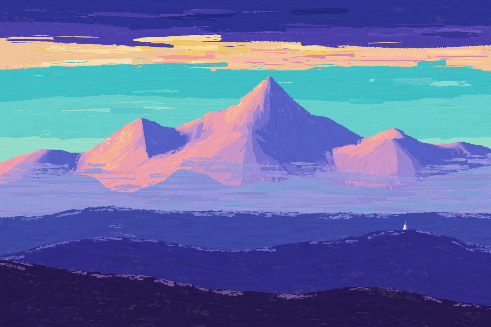</a></p>

**The Last Light on the Snows**, 2026  
Tempera on canvas, laid in flat and gone over with a brush almost dry  
<sub>After Nicholas Roerich, the Himalayan paintings in tempera, 1924–47: the Himalayas series; Mount of Five Treasures (Kanchenjunga), 1933; Sacred Himalayas, 1933; the Tibet series; Path to Shambhala, 1933</sub>

> The last of the sun on one massif of snow: three summits laid in a few broad planes, rose and gold where they face the sun and violet where they turn away, over a band of mist and three dark bands of foothills. The light is dragged on nearly dry, so it breaks on the canvas.

<sub>[`works/naggar.py`](works/naggar.py) · 430 lines</sub>

## II · The Garden

<sub>Flowers, a pond, a window</sub>

<p align="center"><a href="plates/irises.jpg"></a></p>

**Irises in the Asylum Garden**, 2026  
Oil on canvas, in thick strokes from a loaded brush  
<sub>After Vincent van Gogh, Irises, Saint-Rémy, May 1889</sub>

> A bed of irises seen close and from above, each flower a few curling strokes of blue drawn round in a darker one, each leaf a few long strokes of blue-green. One iris is white.

<sub>[`works/irises.py`](works/irises.py) · 566 lines</sub>

<p align="center"><a href="plates/almond.jpg"></a></p>

**Almond Branches against the Sky**, 2026  
Oil on canvas, in thick strokes, the flowers in loaded touches of white  
<sub>After Vincent van Gogh, Almond Blossom, Saint-Rémy, 1890</sub>

> Almond branches seen from below, drawn round in dark paint and set flat against the sky, as in the Japanese prints he collected. Each flower is a few touches of white from a loaded brush.

<sub>[`works/almond.py`](works/almond.py) · 527 lines</sub>

<p align="center"><a href="plates/isles_of_shoals.jpg"></a></p>

**Poppies above the Ledges, Appledore**, 2026  
Oil on canvas, on a pale ground left showing: the flowers in loaded touches of pure colour, the leaves and grasses in short broken strokes, the sea in level ones  
<sub>After Childe Hassam, the paintings of Celia Thaxter's garden, Appledore, 1890–94</sub>

> A cottage garden on a granite island in July, poppies and cornflowers running down to the ledges, hollyhocks against the sea. The flowers went on last, each in a few loaded touches of colour.

<sub>[`works/isles_of_shoals.py`](works/isles_of_shoals.py) · 688 lines</sub>

<p align="center"><a href="plates/footbridge.jpg"></a></p>

**The Footbridge, Green Harmony**, 2026  
Oil on canvas, in dense layers of greens and blues: the pads in short level strokes, the reflections drawn down between them, the bridge in a few loaded strokes  
<sub>After Claude Monet, the Water Lily Pond with the Japanese footbridge, Giverny, 1899</sub>

> The green wooden footbridge over Monet's lily pond, willows and bamboo crowding behind it and the lilies lying on the water below. The bridge went on last, in a few loaded strokes over the leaves.

<sub>[`works/footbridge.py`](works/footbridge.py) · 550 lines</sub>

<p align="center"><a href="plates/collioure.jpg"></a></p>

**Window on the Harbour, Collioure**, 2026  
Oil on canvas, laid thin and fast in separate strokes of pure colour, the white ground bare between them  
<sub>After Henri Matisse, Open Window, Collioure, 1905</sub>

> A window flung open on the harbour, the casements and the wall round them in viridian, violet, vermilion and pink. Each colour is laid on thin in its own patch or dash, and the white canvas shows between them.

<sub>[`works/collioure.py`](works/collioure.py) · 509 lines</sub>

<p align="center"><a href="plates/attersee.jpg">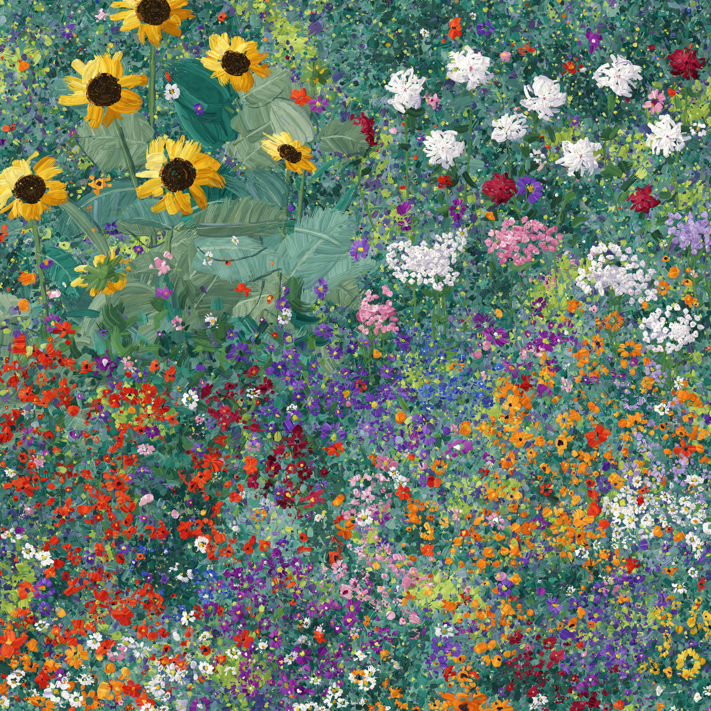</a></p>

**A Cottage Garden at Litzlberg**, 2026  
Oil on canvas, thinly painted, the flowers in small raised touches of pure colour  
<sub>After Gustav Klimt, the garden paintings of his summers on the Attersee: Rosebushes under the Trees (1905), Farm Garden with Sunflowers (1907), Cottage Garden (Bauerngarten, 1907), Farm Garden with Crucifix (1912)</sub>

> A square of cottage garden as flat as a tapestry: sunflowers, white dahlias and phlox standing in a deep green matrix sown with points of colour, over a carpet of marigolds, poppies, asters and marguerites packed edge to edge.

<sub>[`works/attersee.py`](works/attersee.py) · 737 lines</sub>

<p align="center"><a href="plates/bievres.jpg">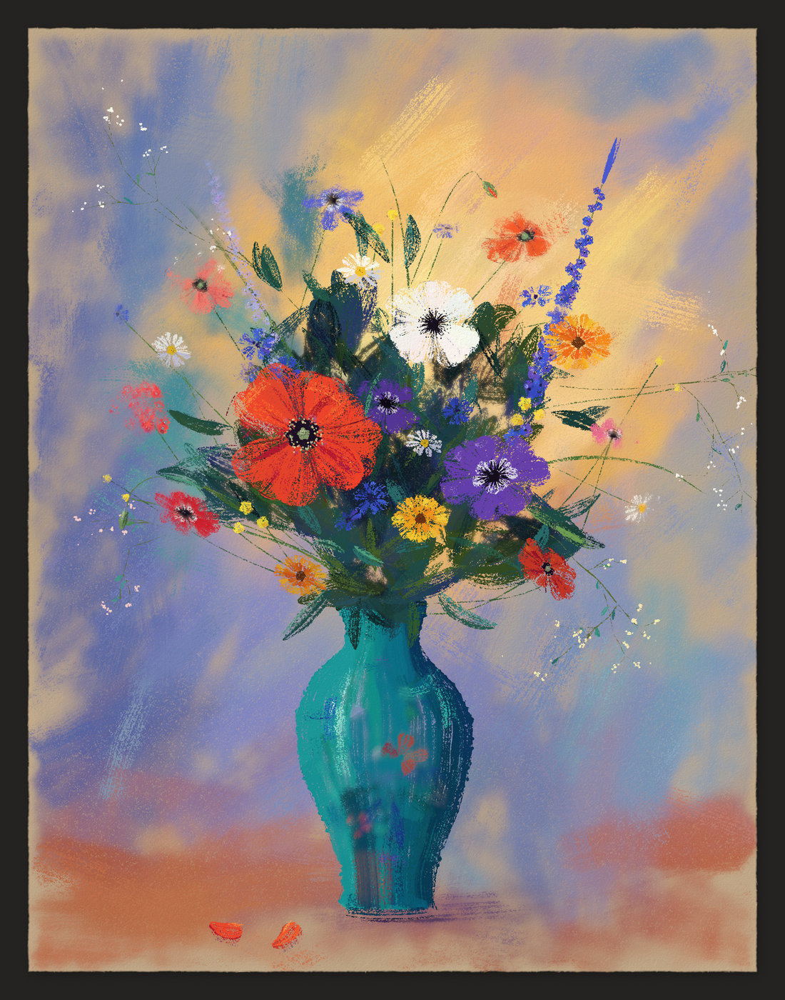</a></p>

**Garden Flowers in a Turquoise Vase**, 2026  
Pastel on buff paper, laid with the side and the tip of the stick and rubbed in places with the hand  
<sub>After Odilon Redon, the pastels of flowers, c. 1905–1914: Vase of Flowers; Bouquet in a Chinese Vase; Wild Flowers in a Long-necked Vase</sub>

> Poppies, anemones, cornflowers, marigolds and larkspur in a turquoise vase, coming out of a field of rubbed blue and gold with no table under it. A few of the flowers blaze, some stand in shadow, and those at the edges are given back to the field.

<sub>[`works/bievres.py`](works/bievres.py) · 982 lines</sub>

<p align="center"><a href="plates/jardin.jpg">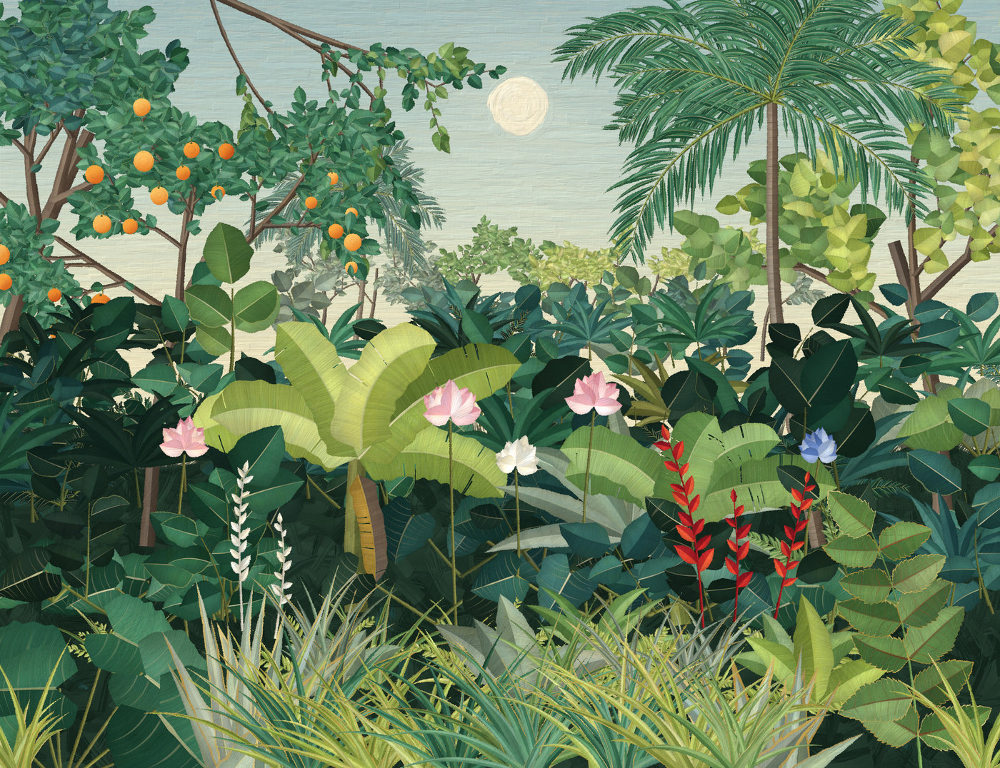</a></p>

**Exotic Garden with a Pale Sun**, 2026  
Oil on canvas, thinly painted, every leaf drawn round with a small brush  
<sub>After Henri Rousseau, the jungle paintings, Paris, 1891–1910: Surprised! (1891), The Snake Charmer (1907), Exotic Landscape (1908 and 1910), The Dream (1910)</sub>

> A jungle built row behind row, as Rousseau built his from the hothouses of the Jardin des Plantes: a pale sun between an orange tree and a palm, and lotus and red bracts lit against the dark thicket, every leaf drawn whole in a green of its own.

<sub>[`works/jardin.py`](works/jardin.py) · 975 lines</sub>

<p align="center"><a href="plates/giverny.jpg"></a></p>

**The Lily Pond, Clouds and Willows**, 2026  
Oil on canvas, thin and thick: a fluid lay-in, long strokes in the reflections, scumbles dragged over dry paint, the pads in loaded dabs  
<sub>After Claude Monet, the Water Lilies for the Orangerie, Giverny, 1914–26</sub>

> The surface of the pond seen close, with no bank and no horizon: clouds and willows reflected in it, lilies lying on it. The paint went on in sittings, each over the last once it had dried.

<sub>[`works/giverny.py`](works/giverny.py) · 388 lines</sub>

<p align="center"><a href="plates/le_cannet.jpg">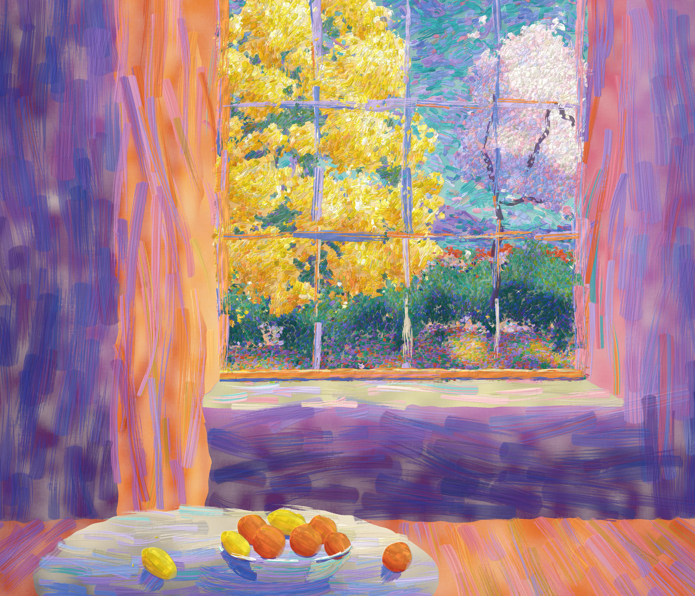</a></p>

**The Window onto the Mimosa, Le Cannet**, 2026  
Oil on canvas: broad thin scumbles, hatchings and small dense touches of unmixed colour  
<sub>After Pierre Bonnard, the late interiors and windows at Le Bosquet, Le Cannet: The Studio with Mimosa, 1939–46, and Almond Tree in Blossom, 1947</sub>

> A window in February, its bars crossing a mimosa in flower, with a bowl of oranges and lemons on the table before it. The room is laid in broad, thin strokes and left quiet, so that the small dense touches of the garden blaze against it.

<sub>[`works/le_cannet.py`](works/le_cannet.py) · 789 lines</sub>

<p align="center"><a href="plates/hollywood.jpg">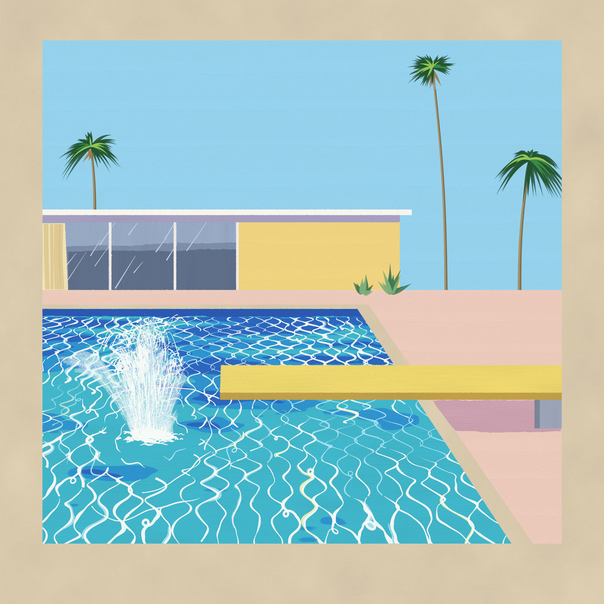</a></p>

**A Pool in the Hills, Noon**, 2026  
Acrylic on cotton duck, rolled and brushed flat against tape, the border and the copings left bare  
<sub>After David Hockney, the Los Angeles swimming pools in acrylic on canvas: Picture of a Hollywood Swimming Pool (1964), Peter Getting Out of Nick's Pool (1966), The Splash, A Little Splash and A Bigger Splash (1966–67), Portrait of an Artist (Pool with Two Figures) (1972)</sub>

> A pool on a terrace above Hollywood at noon, seen at an angle, with no one in it: a diving board run out over the water, the splash the diver left, and the light on the water drawn in loose lines of white.

<sub>[`works/hollywood.py`](works/hollywood.py) · 745 lines</sub>

## III · Paper and Water

<sub>Watercolour, ink and mineral colour</sub>

<p align="center"><a href="plates/yatsuhashi.jpg">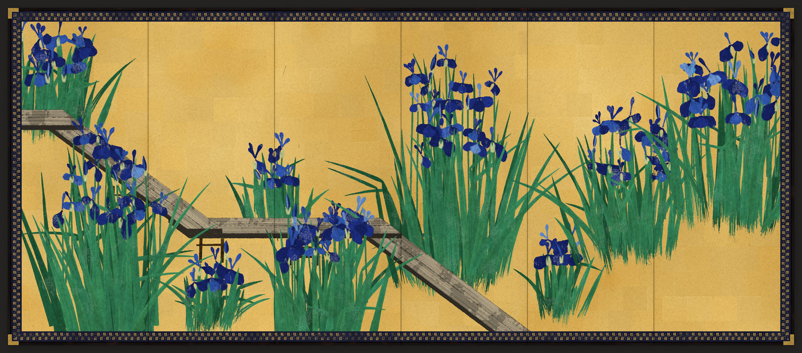</a></p>

**Irises by the Plank Bridge**, 2026  
Six-panel folding screen: ink and mineral colour on gold leaf over paper  
<sub>After Ogata Kōrin, Irises (Kakitsubata-zu), pair of six-panel screens, c. 1701–05, Nezu Museum, Tokyo; and Irises at Yatsuhashi (Eight Bridges), pair of six-panel screens, c. 1711–14, Metropolitan Museum of Art, New York</sub>

> A new screen of Kōrin's irises: nine clumps in azurite and malachite rise and fall across six panels of gold leaf, and a bridge of grey planks zigzags up through them.

<sub>[`works/yatsuhashi.py`](works/yatsuhashi.py) · 647 lines</sub>

<p align="center"><a href="plates/corfu.jpg"></a></p>

**A Wall in the Sun, Corfu**, 2026  
Watercolour, with a few touches of body colour, on rough rag paper  
<sub>After John Singer Sargent, the late watercolours, 1900–1911: Corfu: Lights and Shadows; Olive Trees, Corfu; Corfu: The Terrace</sub>

> A whitewashed garden wall above the sea at noon, with the shade of an olive thrown across it in one wash of cobalt and rose. The wall in the sun is the bare paper.

<sub>[`works/corfu.py`](works/corfu.py) · 628 lines</sub>

<p align="center"><a href="plates/baghdad.jpg">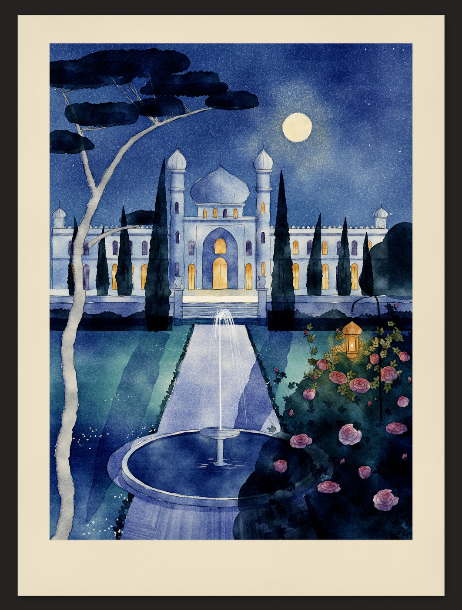</a></p>

**The Caliph's Garden by Moonlight**, 2026  
Watercolour and body colour over pen and ink; the colour plate tipped onto a cream page  
<sub>After Edmund Dulac, the fairy-tale illustrations of 1907–1916 in watercolour over pen and ink: Stories from the Arabian Nights (1907); The Sleeping Beauty and Other Fairy Tales (1910); Stories from Hans Andersen (1911)</sub>

> A palace out of the Arabian Nights across its garden at night, the windows lit, with a fountain on the axis, cypresses, a leaning pine and a rose bush with a brass lantern glowing in it. Every line was drawn freehand with a fine nib; the blue of the sky is four washes, each washed down before the next.

<sub>[`works/baghdad.py`](works/baghdad.py) · 1324 lines</sub>

<p align="center"><a href="plates/kairouan.jpg"></a></p>

**White Domes, Kairouan**, 2026  
Watercolour over pencil on paper, mounted on card  
<sub>After Paul Klee, watercolours after the journey to Tunisia of April 1914: Red and White Domes; In the Style of Kairouan</sub>

> A white town in the south as a loose chequer of transparent washes, warm at its heart and cooler towards the edge, with two domes left as bare paper.

<sub>[`works/kairouan.py`](works/kairouan.py) · 513 lines</sub>

<p align="center"><a href="plates/seebull.jpg">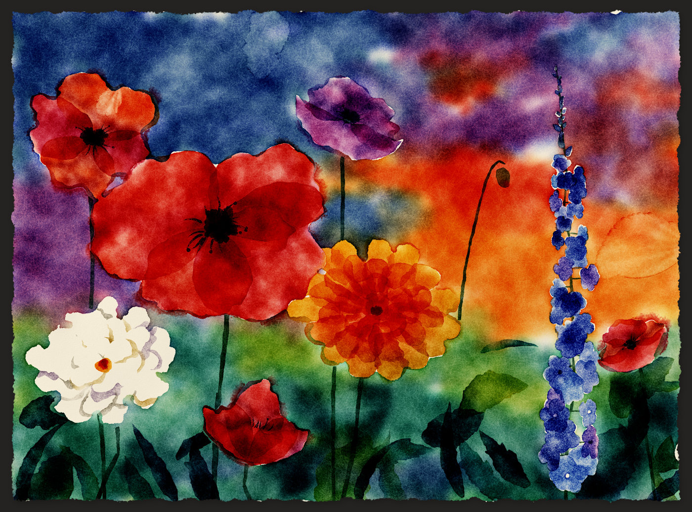</a></p>

**Poppies and Dahlias, Evening**, 2026  
Watercolour on Japan paper  
<sub>After Emil Nolde, the flower and marsh watercolours on Japan paper from Utenwarf and Seebüll, 1920s–1940s: Marsh Landscape with Red Clouds (early 1920s); Sunflowers (1925–28); Poppies (c. 1930); and the Unpainted Pictures (Ungemalte Bilder), 1938–45</sub>

> Poppies, dahlias and a spike of delphinium against an evening sky, laid wet into wet on damp Japan paper and left to run; the white dahlia is the bare paper.

<sub>[`works/seebull.py`](works/seebull.py) · 998 lines</sub>

<p align="center"><a href="plates/ghost_gum.jpg"></a></p>

**Ghost Gum, West MacDonnell Ranges**, 2026  
Watercolour over pencil on rough rag paper  
<sub>After the watercolours of Albert Namatjira and the Hermannsburg School, Central Australia, c. 1950</sub>

> A ghost gum on the bank of a dry creek under the West MacDonnell Ranges, its trunk the white of the paper. The rock is built up in glazes of ochre, light red and violet, each laid when the last was dry.

<sub>[`works/ghost_gum.py`](works/ghost_gum.py) · 763 lines</sub>

<p align="center"><a href="plates/burbank.jpg">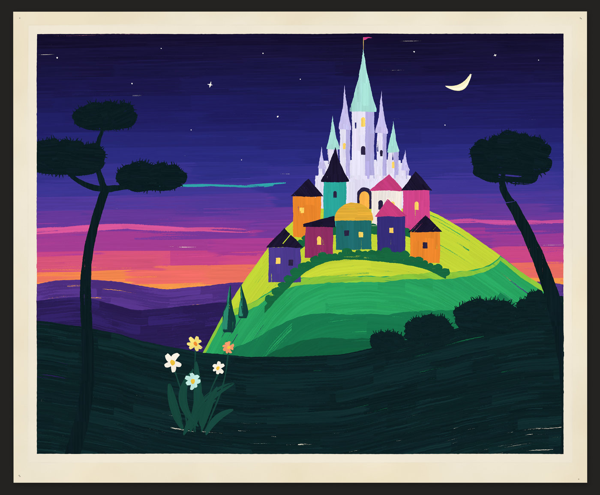</a></p>

**A Hill Town at Dusk**, 2026  
Gouache on illustration board  
<sub>After Mary Blair, concept paintings for Walt Disney Studios: Saludos Amigos, 1942; Cinderella, 1950; Alice in Wonderland, 1951; Peter Pan, 1953; and the designs for It's a Small World, 1964</sub>

> A pale castle on a chartreuse hill against a dusk that goes from ultramarine to magenta and orange, the town stacked under it in a few blocks of colour with a window lit here and there. A dark bank, an umbrella pine and a tufted tree, black against the glow, frame the view.

<sub>[`works/burbank.py`](works/burbank.py) · 891 lines</sub>

<p align="center"><a href="plates/jiangnan.jpg"></a></p>

**Water Town in Spring**, 2026  
Watercolour woodblock print (shuiyin muke), twenty-one impressions from twenty blocks, on dampened xuan paper  
<sub>After the watercolour woodcuts of the Jiangsu school, Nanjing, 1960s–1980s, and the Ten Bamboo Studio manual, Nanjing, 1633</sub>

> White walls and dark tiles across a canal on a spring morning after rain. The walls are the bare paper; the reflections are cut from the same drawing turned upside down and printed paler and wetter.

<sub>[`works/jiangnan.py`](works/jiangnan.py) · 753 lines</sub>

<p align="center"><a href="plates/hakone.jpg">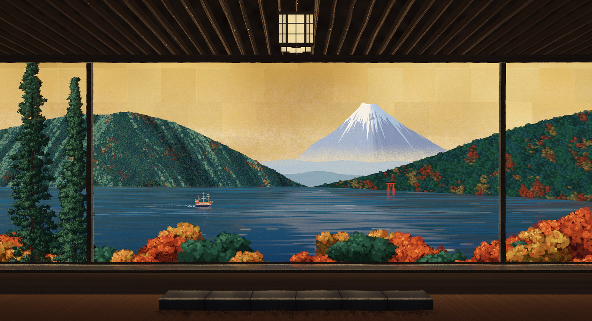</a></p>

**The Window over Lake Ashi**, 2026  
Mineral colour (iwa-enogu), ink, shell white and gold leaf on hemp paper, mounted on a panel  
<sub>After Modern Nihonga as the Narukawa Art Museum, Hakone, has collected it since it opened in 1988: Yamamoto Kyūjin, Hirayama Ikuo, Kayama Matazō, Hori Fumiko; and the still blue-green lakes and mountains of Higashiyama Kaii, such as Green Echoes (Midori hibiku), 1982, Nagano Prefectural Art Museum</sub>

> The window of the museum's lounge, which frames Fuji over Lake Ashi like a painting, painted as one: the view in mineral colour on gold leaf, the dark room round it in ink. On the water one of the lake's sightseeing ships, dressed as a galleon, trails its wake toward the shrine.

<sub>[`works/hakone.py`](works/hakone.py) · 1187 lines</sub>

<p align="center"><a href="plates/sayama.jpg">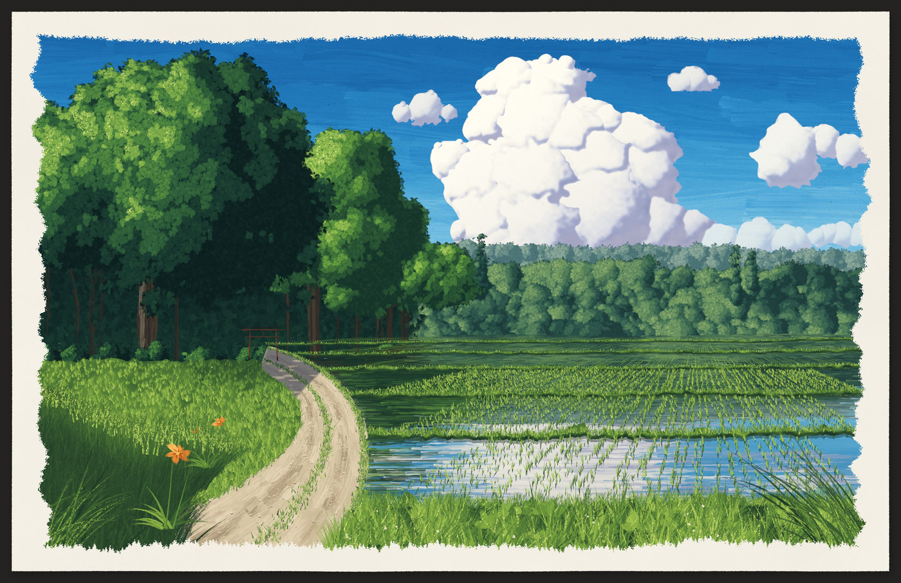</a></p>

**Cumulus over the Sayama Hills**, 2026  
Poster colour (gouache) on drawing paper  
<sub>After Kazuo Oga, the background paintings for Studio Ghibli: My Neighbor Totoro (1988), Kiki's Delivery Service (1989), Only Yesterday (1991), Princess Mononoke (1997)</sub>

> A summer cumulus over the wooded hills where Totoro is set, the young rice in the paddies holding the sky, and a lane running into the shade of a shrine grove. The trees are built touch upon touch, from the darkest green to the sunlit tops.

<sub>[`works/sayama.py`](works/sayama.py) · 1222 lines</sub>

## IV · The Workshop

<sub>Glass, copper and the woodblock</sub>

<p align="center"><a href="plates/rose_window.jpg"></a></p>

**North Rose**, 2026  
Pot-metal and flashed glass, painted and fired, leaded, in plate tracery  
<sub>After The north rose of Chartres Cathedral, given by Blanche of Castile, c. 1235</sub>

> A north rose never has the sun on it; this is its light on any grey afternoon. Twelve doves come down to the rose at the centre, among the lilies of France and the castles of Castile: seven thousand pieces of glass, no two of them the same thickness.

<sub>[`works/rose_window.py`](works/rose_window.py) · 550 lines</sub>

<p align="center"><a href="plates/ten_bamboo.jpg">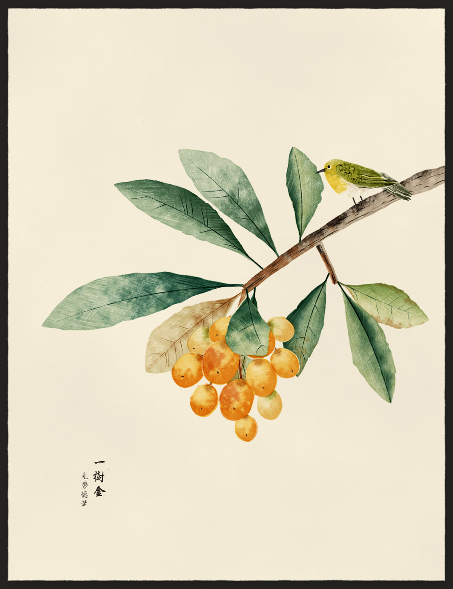</a></p>

**Loquats and a White-eye**, 2026  
Colour woodblock print from assembled blocks (douban) in 131 impressions, with blind embossing (gonghua), on xuan paper  
<sub>After Hu Zhengyan and the Ten Bamboo Studio Manual of Calligraphy and Painting (Shizhuzhai shuhua pu), Nanjing, 1633</sub>

> No keyline: every leaf, fruit and feather is a small block of its own, cut after a brush drawing and wiped so that it shades within its shape. Most of the leaves' veins and the bird's eye-ring and belly are only pressed into the paper.

<sub>[`works/ten_bamboo.py`](works/ten_bamboo.py) · 784 lines</sub>

<p align="center"><a href="plates/low_country.jpg"></a></p>

**The Low Country**, 2026  
Etching, printed on laid paper  
<sub>After Rembrandt van Rijn, Landscape with a Cottage and a Large Tree, Amsterdam, 1641</sub>

> A cottage under its trees on one side of the plate, and on the other the flat land running out to a church tower, a windmill, and a great deal of sky.

<sub>[`works/low_country.py`](works/low_country.py) · 488 lines</sub>

<p align="center"><a href="plates/malmaison.jpg">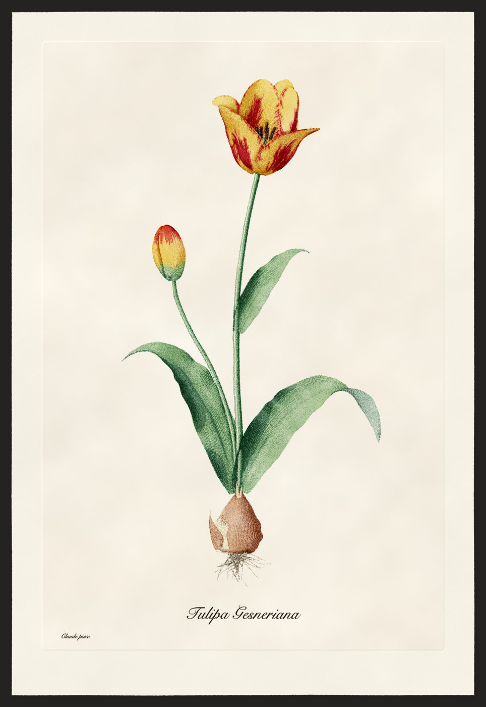</a></p>

**A Flamed Tulip**, 2026  
Stipple engraving printed in colour from one plate inked à la poupée, finished by hand in watercolour, on wove paper  
<sub>After Pierre-Joseph Redouté, Les Liliacées, Paris, 1802–1816, and Les Roses, Paris, 1817–1824: stipple engravings printed in colour and finished by hand in watercolour</sub>

> A garden tulip from its bulb to its flower, open and flamed crimson on yellow, with a bud and three leaves turning to show both faces: every form is built of engraved dots of coloured ink, washed over by hand.

<sub>[`works/malmaison.py`](works/malmaison.py) · 757 lines</sub>

<p align="center"><a href="plates/red_fuji.jpg"></a></p>

**Red Fuji, Clear Morning**, 2026  
Colour woodblock print (moku-hanga) from six blocks, on kozo paper  
<sub>After Katsushika Hokusai, Fine Wind, Clear Morning, from Thirty-six Views of Mount Fuji, Edo, c. 1831</sub>

> Six blocks, printed in turn. The blue was wiped by hand before each pull, so no two skies would ever come out the same.

<sub>[`works/red_fuji.py`](works/red_fuji.py) · 146 lines</sub>

<p align="center"><a href="plates/arashiyama.jpg">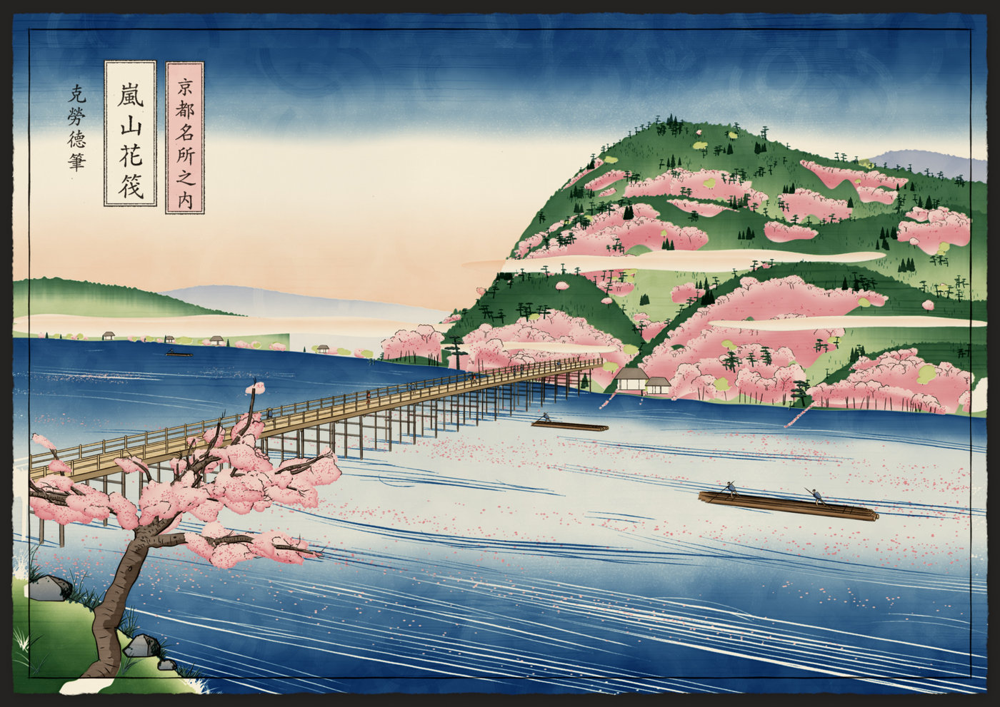</a></p>

**Blossom Rafts at Arashiyama**, 2026  
Colour woodblock print (nishiki-e) in thirty-five impressions, ōban yoko-e, on hōsho paper  
<sub>After Utagawa Hiroshige, Famous Places in Kyoto (Kyōto meisho no uchi), c. 1834, among them Cherry Blossoms in Full Bloom at Arashiyama</sub>

> Timber rafts come down the Ōi toward the long bridge, and the petals that fall on the river drift down it in rafts of their own. On the mountain the cherries stand in drifts, a few crowns cut along the top of each and the deeper pink wiped down beneath them into the mist.

<sub>[`works/arashiyama.py`](works/arashiyama.py) · 1151 lines</sub>

<p align="center"><a href="plates/shower.jpg"></a></p>

**Shower on the Long Bridge**, 2026  
Colour woodblock print (moku-hanga) from seventeen blocks, on kozo paper  
<sub>After Utagawa Hiroshige, Sudden Shower over Shin-Ōhashi Bridge and Atake, from One Hundred Famous Views of Edo, 1857</sub>

> The rain is cut on two blocks, one printed in sumi and one in grey, their lines at slightly different slants. The river was wiped darker toward the near bank before every pull.

<sub>[`works/shower.py`](works/shower.py) · 514 lines</sub>

<p align="center"><a href="plates/laurelton.jpg">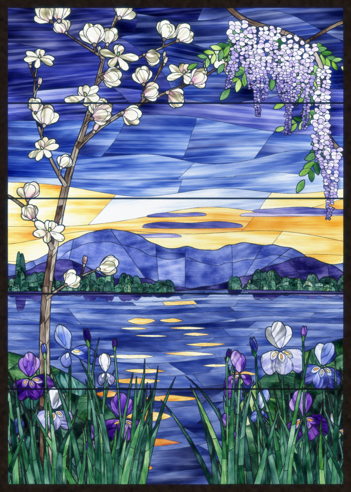</a></p>

**An Evening in May**, 2026  
Opalescent glass, streaky, mottled, drapery, ripple, confetti and streamer, plated in places, in copper foil and lead, with iron bars  
<sub>After Louis Comfort Tiffany and Tiffany Studios, the landscape windows in opalescent glass, New York, c. 1900–1925: Magnolias and Irises, c. 1908; Autumn Landscape, 1923–24; the windows for Laurelton Hall</sub>

> A magnolia and a wisteria in flower frame a sunset over blue hills, and irises stand at the edge of the river. Nothing is painted: every colour is in the glass, each piece chosen for where its streaks fall.

<sub>[`works/laurelton.py`](works/laurelton.py) · 974 lines</sub>

<p align="center"><a href="plates/inland_sea.jpg"></a></p>

**Evening Sails**, 2026  
Colour woodblock print (shin-hanga) in twenty-five impressions, on kozo paper  
<sub>After Hiroshi Yoshida, Sailing Boats, from the Inland Sea series, 1926</sub>

> Yoshida printed the same blocks again for different hours of the day. This new design is pulled for the evening: the sails take the last of the sun, and the sea gives them back in pieces.

<sub>[`works/inland_sea.py`](works/inland_sea.py) · 406 lines</sub>

<p align="center"><a href="plates/riviera.jpg">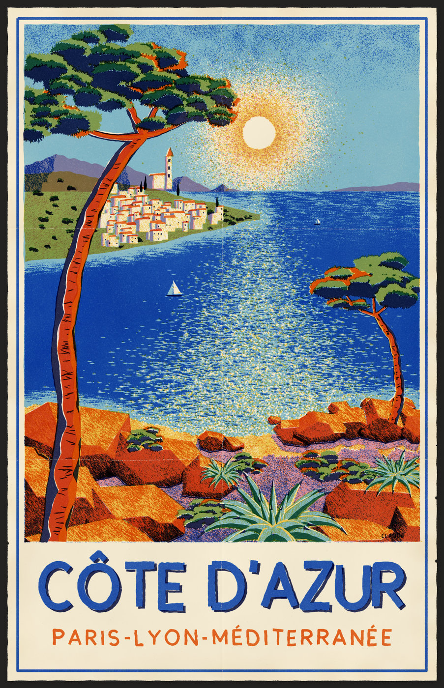</a></p>

**The Bay through the Pines**, 2026  
Colour lithograph poster, printed from seven stones on machine-made paper  
<sub>After Roger Broders, the travel posters for the Paris–Lyon–Méditerranée railway, 1920s–1930s: Menton, c. 1923; Agay, 1928; Antibes, c. 1928; Sainte-Maxime; Villefranche-sur-Mer</sub>

> A new poster for the Côte d'Azur: an umbrella pine leaning out over a deep blue bay, the sun on the water and a white town on its headland, with agaves and red rocks cut into planes below. Seven stones, drawn in tusche, crayon and spatter and printed a hair out of register.

<sub>[`works/riviera.py`](works/riviera.py) · 881 lines</sub>

<p align="center"><a href="plates/sydney.jpg">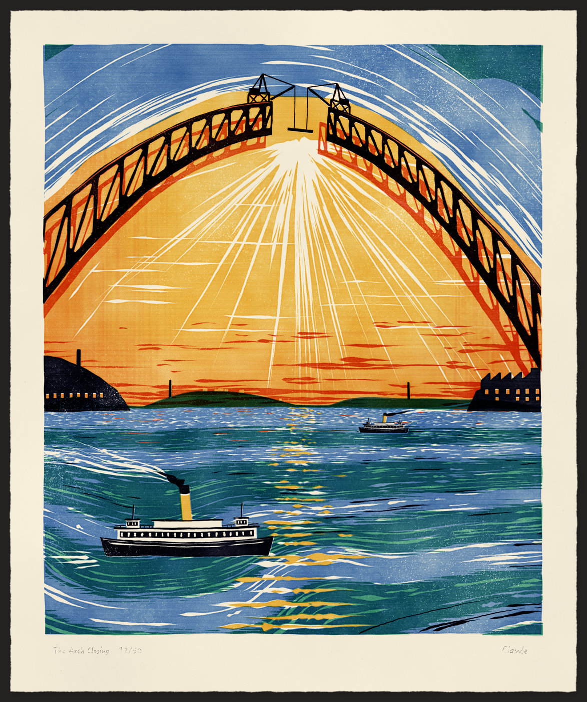</a></p>

**The Arch Closing**, 2026  
Colour linocut from five blocks in oil-based ink, burnished by hand, on thin Japanese paper  
<sub>After Dorrit Black, The Bridge, Sydney, 1930, and the Grosvenor School colour linocut of Claude Flight, Sybil Andrews and Cyril Power, London, 1929–1933</sub>

> The two halves of the Harbour Bridge reach for each other from their creeper cranes, weeks before they met, with the afternoon light breaking through the gap. Five blocks burnished by hand with a spoon overprint to make the oranges and the deep blue-greens.

<sub>[`works/sydney.py`](works/sydney.py) · 877 lines</sub>

## V · Colour Itself

<sub>Abstraction</sub>

<p align="center"><a href="plates/stockholm.jpg"></a></p>

**Youth, with Two Spirals**, 2026  
Tempera on paper, the sheets joined and mounted on canvas  
<sub>After Hilma af Klint, The Ten Largest (De tio största), Stockholm, 1907</sub>

> Two spirals, a great flower and three circles float on a ground of orange among buds, dots and tendrils; where forms cross, each shows through the other.

<sub>[`works/stockholm.py`](works/stockholm.py) · 559 lines</sub>

<p align="center"><a href="plates/louveciennes.jpg"></a></p>

**Sun and Moon**, 2026  
Oil on canvas, thinned in places and loaded in others  
<sub>After Robert Delaunay, Circular Forms (Formes circulaires), Louveciennes, 1912–13; Sonia Delaunay, Electric Prisms (Prismes électriques), 1914</sub>

> Discs of unmixed colour, ringed and quartered so that orange meets blue, red meets green and yellow meets violet. A warm sun and a smaller, cool moon hold the two ends, and one great arc crosses everything.

<sub>[`works/louveciennes.py`](works/louveciennes.py) · 462 lines</sub>

<p align="center"><a href="plates/nice.jpg">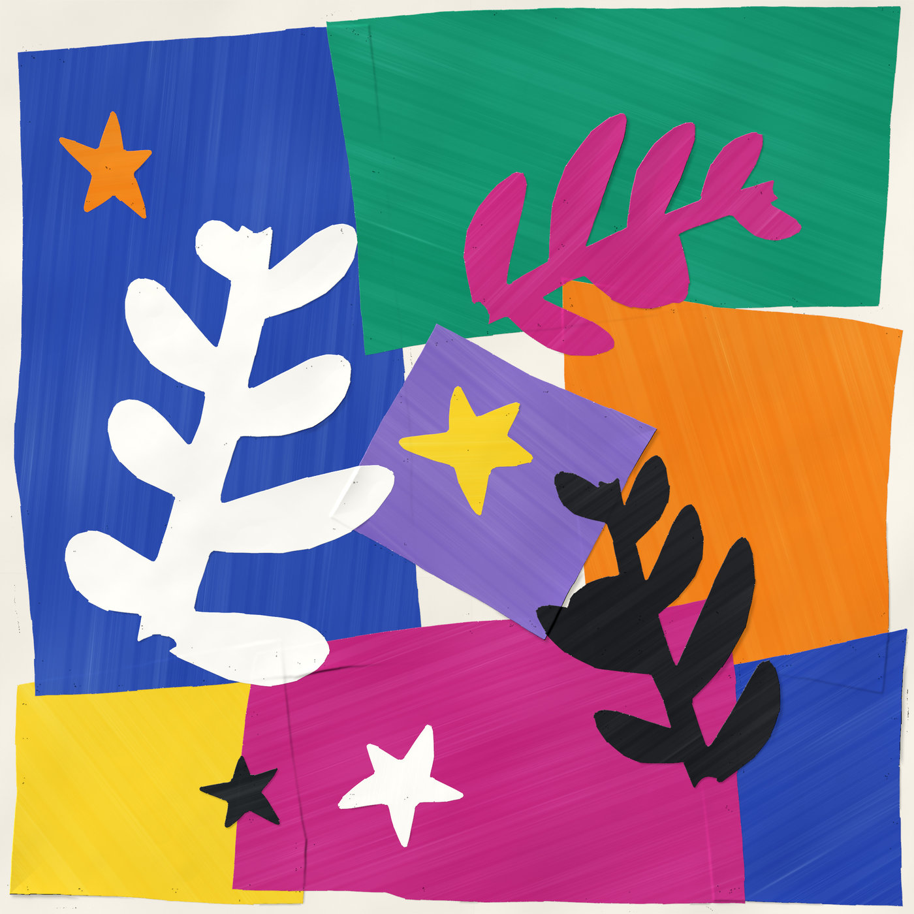</a></p>

**The Sea Garden**, 2026  
Gouache on paper, cut and pasted on white paper, mounted on canvas  
<sub>After Henri Matisse, the cut-outs (gouaches découpées) of his last years at the Hôtel Régina, Nice, 1950–1954: Beasts of the Sea, 1950; Memory of Oceania, 1952–53; The Snail, 1953; The Sheaf, 1953</sub>

> Slabs of pure colour pasted turning round a violet one set askew, and over them three sea weeds and four stars cut freehand from sheets brushed with other colours, crossing from one ground into the next.

<sub>[`works/nice.py`](works/nice.py) · 571 lines</sub>

<p align="center"><a href="plates/agrigento.jpg">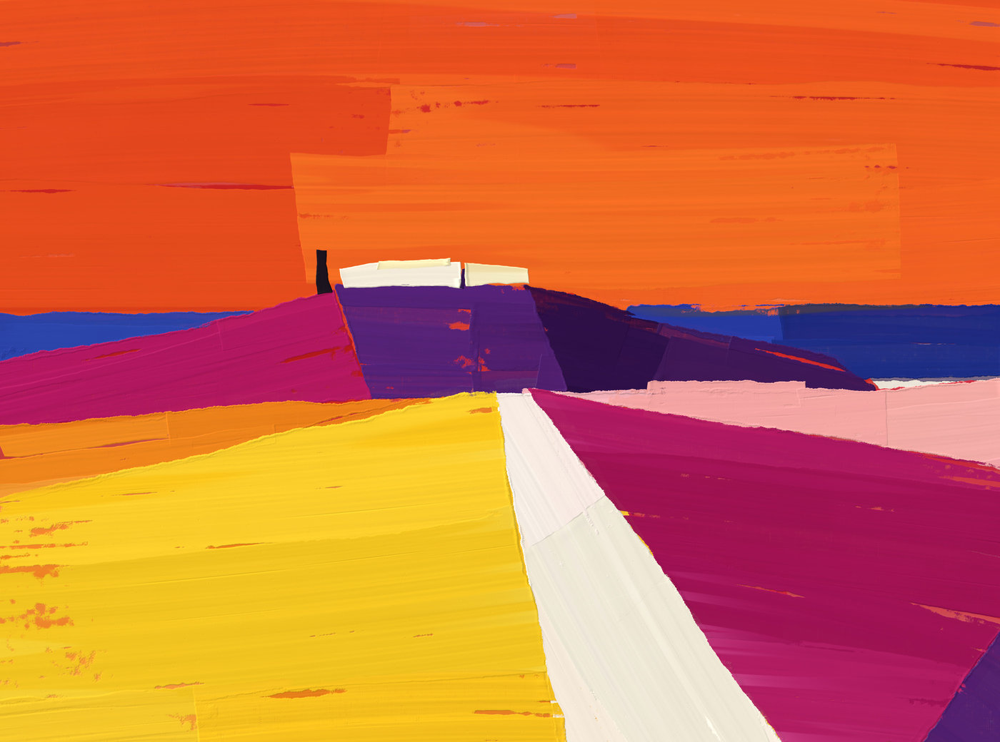</a></p>

**The Temple above the Sea**, 2026  
Oil on canvas, laid on with palette knives and a broad spatula  
<sub>After Nicolas de Staël, the Sicilian landscapes painted after his journey of 1953: Agrigente (1953–54), Sicile (1954), Paysage de Sicile (1954)</sub>

> A temple on a dark hill under a vermilion sky, the sea on either side and a white road climbing to it through hot planes of yellow and magenta, each plane built of knife passes dragged over a lay-in of another colour, which shows at their edges.

<sub>[`works/agrigento.py`](works/agrigento.py) · 403 lines</sub>

<p align="center"><a href="plates/around_blue.jpg">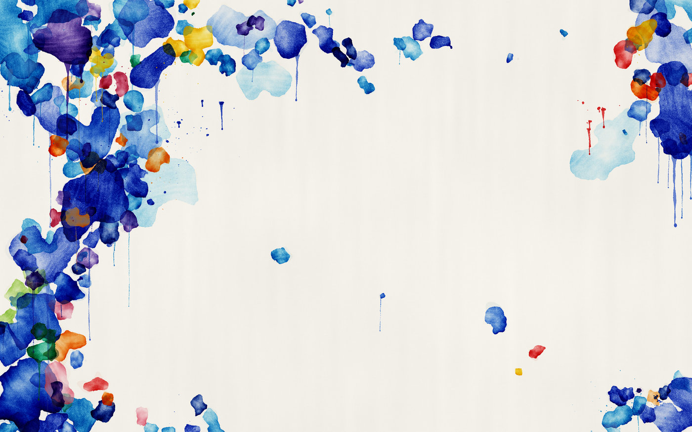</a></p>

**The White Between**, 2026  
Oil thinned with turpentine on white-primed cotton duck  
<sub>After Sam Francis, the paintings of 1953–65: Big Red (1953), the Basel Mural (1956–58), Around the Blues (1957, 1962–63), the Blue Balls series (1960–63) and the first Edge paintings (1964–65)</sub>

> Cells of cerulean, cobalt and ultramarine, with touches of yellow, orange, red and green, crowd down the left of a white canvas, drift along the top and gather in the corners on the right; the thin oil dried with dark edges round paler middles and ran down in drips.

<sub>[`works/around_blue.py`](works/around_blue.py) · 359 lines</sub>

<p align="center"><a href="plates/provincetown.jpg"></a></p>

**Harbor, August**, 2026  
Acrylic thinned with water, poured and stained into unprimed cotton duck, over charcoal  
<sub>After Helen Frankenthaler, the soak-stain paintings, from Mountains and Sea (1952) to The Bay (1963)</sub>

> Ultramarine, cerulean, coral, sap green and a little ochre poured onto raw cotton duck laid on the floor, each shape left as the paint ran out, with the bare canvas between them.

<sub>[`works/provincetown.py`](works/provincetown.py) · 311 lines</sub>

<p align="center"><a href="plates/washington.jpg">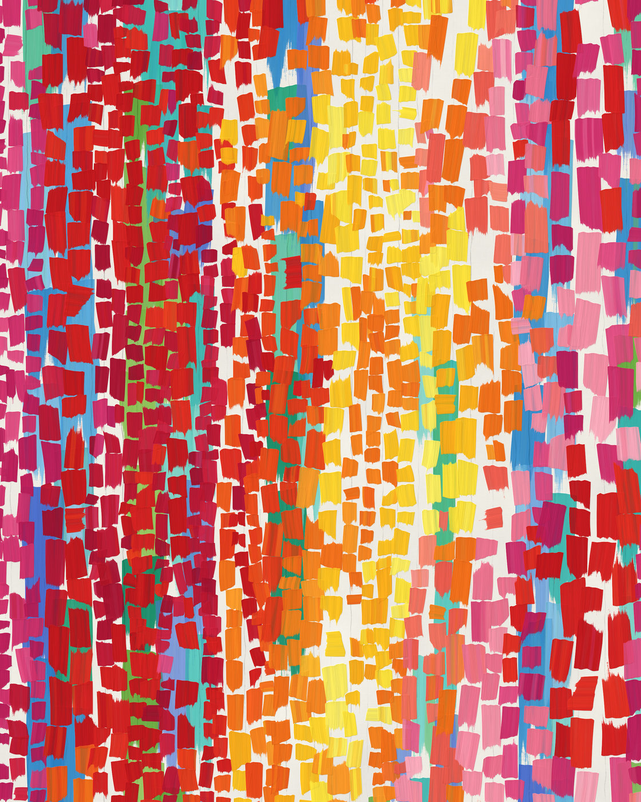</a></p>

**Morning Sun in the Garden**, 2026  
Acrylic and pencil on canvas: columns of touches of a flat brush over loosely brushed bands of blue and green  
<sub>After Alma Thomas, the paintings she made in Washington, 1966–76: Resurrection (1966), Starry Night and the Astronauts (1972), Red Roses Sonata (1972), Elysian Fields (1973), Wind and Crepe Myrtle Concerto (1973)</sub>

> Columns of short strokes of a flat brush, crimson, red, orange, yellow and pink, change across the canvas in bands. Where a leaning band of yellow falls the white canvas opens between them; elsewhere flecks of blue and green show from beneath.

<sub>[`works/washington.py`](works/washington.py) · 290 lines</sub>

<p align="center"><a href="plates/ocean_park.jpg">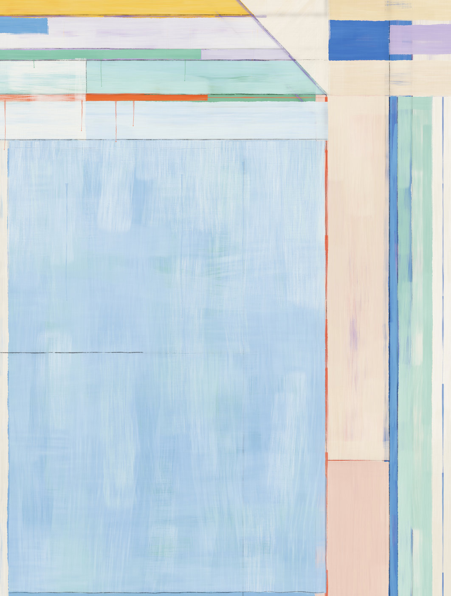</a></p>

**The Window at Ocean Park**, 2026  
Oil and charcoal on canvas, laid in thin and painted over in three sittings, scraped back and redrawn  
<sub>After Richard Diebenkorn, the Ocean Park paintings, Santa Monica, 1967–88 (among them Ocean Park No. 54, 1972; No. 79, 1975; No. 129, 1984)</sub>

> A scaffold of bands across the top and down the right, a diagonal across the corner where they meet, and a large pale field of sea light, painted over three times so that the earlier lines and colours still show through.

<sub>[`works/ocean_park.py`](works/ocean_park.py) · 622 lines</sub>

<p align="center"><a href="plates/rajasthan.jpg">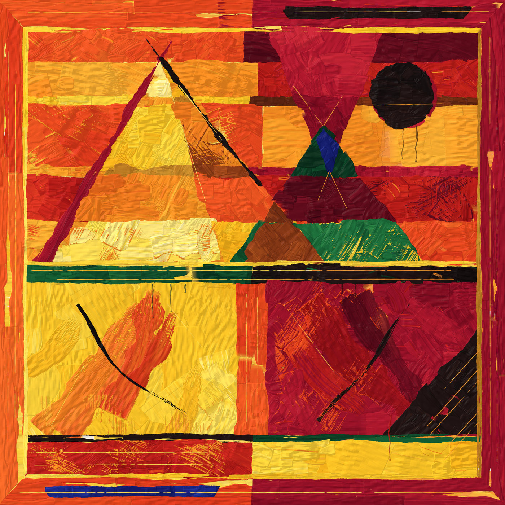</a></p>

**The Black Sun**, 2026  
Acrylic on canvas, laid on with the knife and the brush in layers, scumbled, run and scratched  
<sub>After S. H. Raza, the paintings of Rajasthan and Saurashtra made in Paris from the mid 1970s: Rajasthan (1975), Rajasthan (1983), Saurashtra (1983), La Terre (1985)</sub>

> Two triangles stand in a banded sky as planes of colour, crossed by the bands and making a third colour where they overlap, under a black sun; below, a saffron room and a carmine one, each crossed by broad strokes of its own colour deepened. Acrylic spread with the knife zone by zone, scumbled, and scratched down to the yellow ground.

<sub>[`works/rajasthan.py`](works/rajasthan.py) · 631 lines</sub>

<p align="center"><a href="plates/rue_jonquoy.jpg"></a></p>

**Light Rising over Water**, 2026  
Oil on canvas, thinned almost to a wash and laid in many veils with broad brushes and a rag, wiped back and left to run; drawn into with a smaller brush, a few touches laid thick with a loaded brush  
<sub>After Zao Wou-Ki, the large oils of the 1980s, such as Juin–Octobre 1985</sub>

> A space of light with no landscape in it: veils of blue deepening into indigo round a pale gold core, thin paint running down, and clusters of dark strokes drawn fast through the middle.

<sub>[`works/rue_jonquoy.py`](works/rue_jonquoy.py) · 578 lines</sub>

<p align="center"><a href="plates/monsoon.jpg">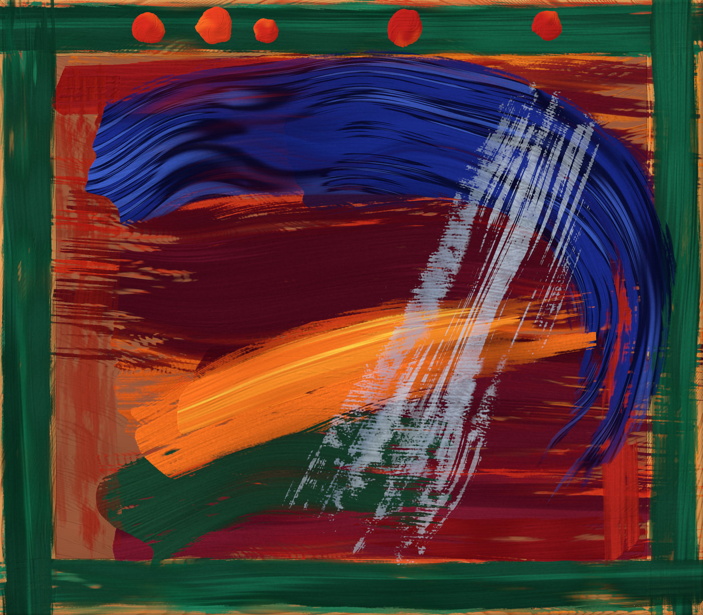</a></p>

**The Monsoon Breaking**, 2026  
Oil on a mahogany panel in a pine frame, the frame painted as part of the picture  
<sub>After Howard Hodgkin, the paintings on wood of the 1980s: Venice Evening (1984–85), Rain (1984–89), Love Letter (1984–88), In Tangier (1987–90), Indian Sky (1988–89)</sub>

> The monsoon breaking over a garden, remembered. Inside a deep green frame and a red one, one sweep of ultramarine curls over a crimson dark with the light glowing hot beneath it, and the rain is dragged across in a pale, dry veil that lets the colour show through.

<sub>[`works/monsoon.py`](works/monsoon.py) · 627 lines</sub>

<p align="center"><a href="plates/cologne.jpg"></a></p>

**Abstract Picture**, 2026  
Oil on canvas: loose passages of colour brushed on, then dragged and scraped with a squeegee, wet into wet and over half-dry paint, with fresh colour between the pulls  
<sub>After Gerhard Richter, the squeegee paintings (Abstraktes Bild), Cologne, late 1980s and 1990s</sub>

> Colour brushed on in broad passages, then dragged down the canvas with a long squeegee, again and again over some days. Each pull scrapes the paint off the high places and lays it into the low ones, and skips, so that the earlier layers show through.

<sub>[`works/cologne.py`](works/cologne.py) · 431 lines</sub>

<p align="center"><a href="plates/vetheuil.jpg"></a></p>

**Sunflowers, Late Summer**, 2026  
Oil on canvas: thin washes that run, broad loaded strokes and fast dry ones of unmixed colour, white painted back over them  
<sub>After Joan Mitchell, La Grande Vallée and the Sunflowers, Vétheuil, 1983–92</sub>

> Masses of cadmium yellow and orange, ultramarine and emerald, high on a white canvas, with thin paint running down from them. The white is painted too, back over the colour, to shape it.

<sub>[`works/vetheuil.py`](works/vetheuil.py) · 400 lines</sub>

---

## Colophon

Every plate in this museum can be made again from its source, on any computer, in a minute or two.

```bash
git clone https://github.com/Chaoqi31/claude-glass && cd claude-glass
uv run render.py giverny     # paint one work into plates/
uv run render.py             # paint them all
uv run site.py               # hang them: the wall, the README and the website
uv run timeline.py           # the film and its score (needs ffmpeg)
```

A work is one Python file in [`works/`](works). It carries its wall label (title, medium, the painter or tradition it follows, the year, the place) and a function, `paint(seed)`, that returns the picture in linear light. Each picture is built the way its medium is: a stroke is a path that carries a load of paint, a block is cut, inked and pressed, glass is cut and leaded, and what you see is whatever the bristles, the pigment and the ground leave behind.

The materials are in [`atelier/`](atelier), each a small module that knows one craft: canvas and thick oil paint that stands in ridges and drags through wet paint ([`impasto.py`](atelier/impasto.py)), watercolour that pools and dries darker at its rim, divided touches of colour, etching and printing, woodblocks cut, inked, wiped and pulled by hand, gouache, stained glass and its leads, the craquelure of old paint, laid and handmade paper. A few works carry a process of their own: a squeegee dragged through wet paint, colour poured into raw cotton. The film's music is made the same way: [`score.py`](score.py) writes it to the film's bars, and [`music.py`](atelier/music.py) sings it, with a voice and a choir built from the resonances of a throat and mouth, a low hum, a drum and a hall. Everything is NumPy, SciPy and Pillow; there is no image model anywhere in this repository.

To add a work, write a new file in `works/` with the same label and a `paint` of its own, render it, and hang it.

The code is released under the [MIT License](LICENSE); the plates, the wall and the film under [CC BY 4.0](plates/LICENSE).
